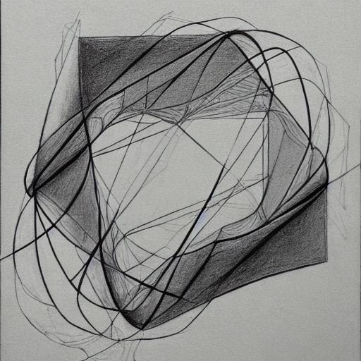

+++
title = "About"
render = true
template = "about.html"
+++

<!--

-->

{{ img(path="@/about/structuralism.png", class="bordered", alt="", caption="Abstract nonsense I got playing arround with Stable Diffusion") }}

&nbsp;

Hello!, my name is Abel Doñate, I am currently studying Mathematics and Engineering Physics at Polytechnic University of Catalonia (UPC).

My main interests are mathematics, music theory and thinking about useless stuff (the judgment of whether the first two are contained in the third is left to the reader). This webpage will be a reflection of that (sorry in advance).

Find my CV <a href="CV.pdf" target="blank">here</a>.
