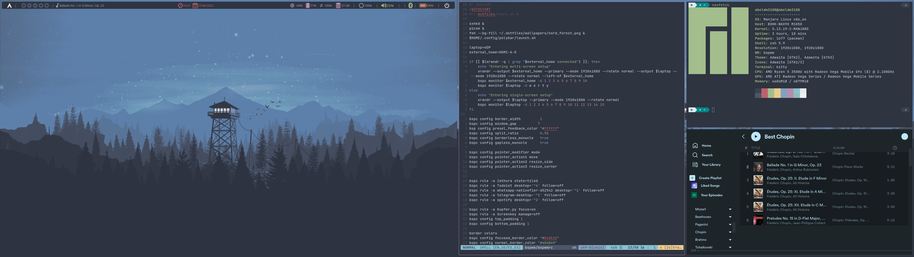

+++
title = "Workflow with bspwm as window manager"
date = 2021-08-11

[taxonomies]
categories = ["software"]
tags = ["dotfiles"]
+++

In this post I'm trying to explain my workflow on the computer. Dotfiles are in [this](https://github.com/abeldonate/.dotfiles) GitHub repo.

I use bspwm as tilling window manager and sxhkd for the shortcuts. I consider it one of the simplest wm for the easy config files and the intuitive working. For those who know the world of wm, bspwm might not be the best option because it is not as complete and modular as other wm, but I think it is a good way to start in ricing linux.

**Bspwm**

***

Bspwm is a tiling window manager that works as a binary tree, splitting the window in two each time you open a window.

**Sxhkd**

***

Sxhkd is a shortcut manager that allows you to store custom shortcuts. Shortcuts are very useful to call actions on bspwm (open, close, move, resize windows, etc) as well as open programs and in general run a custom command.
