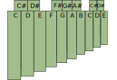
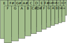
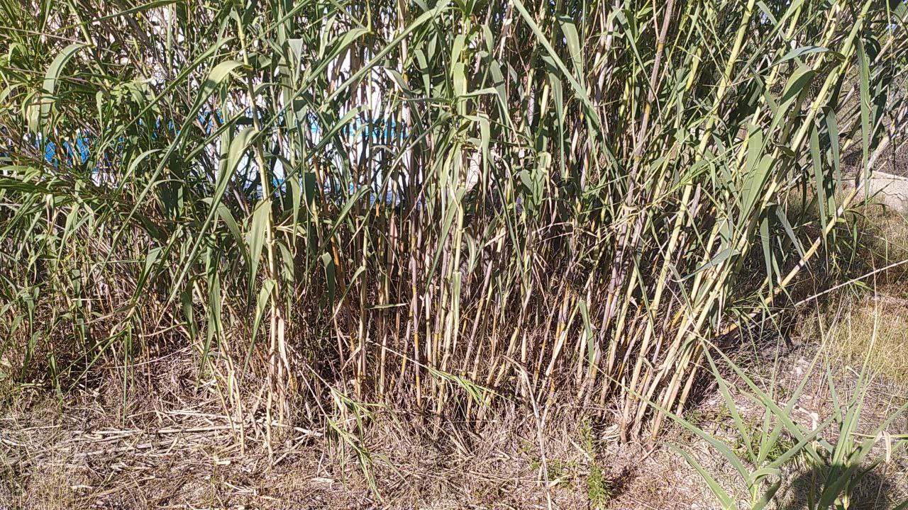
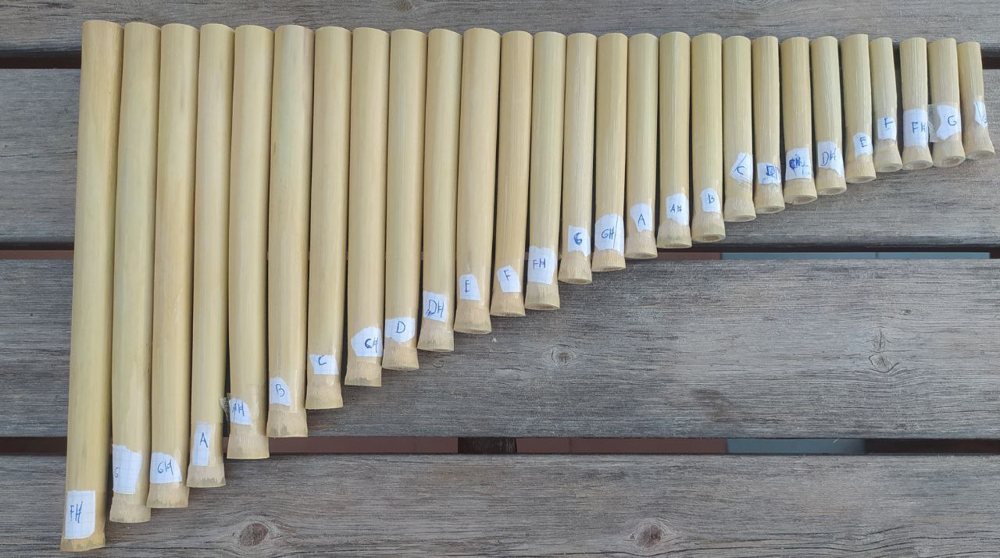

+++
title = "I crafted my own sikus (panflute)"
date = 2023-08-11

[taxonomies]
categories = ["music"]
tags = ["music", "crafting"]
+++

# Motivation

I have always been a music enthusiast from both, the viewpoint of interpretation as well as theoretical issues. The project of making a sikus from scratch captures the essence of both of them, since theoretical knowledge is required (but also non-essential) and I will end up with a new easy to play instrument.

# Design of the sikus
There are plenty of choices for the design of the instrument. The first one is the choice of the material. The most common material is the bamboo, for its abundance in the region of its origins, but they also can be made of cane, processed wood, plastic, and even glass. I made mine of cane due to its proximity.

The next choice is the distribution of the tubes, which have a wide range of options. I suggest in the next pictures four types of them (the naming is not standard):

## Type 1: The linear
The most common type of panflute is the linear one. Just one stripe of tubes with a heptatonic (not equal) distribution. This can be interpreted as the notes of the C Major scale, as well as any greek mode depending which note you are beginning with. Folkloric songs can be performed in this heptatonic scale, but it has some limitations such as the impossibility of scale transport and the lack of some notes of chromatic scale. 

## Type 2: The compact
But, hold on!, we can make a trick to save space and make the sikus more compact by adding a lower stripe. Distances between notes now get narrower, but notes are a little bit trickier to play. Scale is still pentatonic.

## Type 3: The chromatic
If we are used to piano keys, we can arrange the tubes following the same distribution, achieving a chromatic sikus. This has two main advantages: any occidental piece of music (that uses chromatic scale, of course) can be interpreted provided it is in the same range and piano players will find the distribution very comfortable. However, we get rid of the original essence of the instrument and its ethnomusicological implications.

## Type 4: The chromatic compact
We construct this variation by positioning the classical occidental twelve-notes chromatic scale in zig-zag alternating up and down as in the picture. We end up with a sikus in which we can perform every chromatic piece as in the type 3, but the flute is more compact and handle. I'm sure that very few people are used to this configuration, and the reason is hided in the harmony: two common harmonic intervals, 5th major and 4th major (3:2 and 4:3 resp.) lay in different arrays (one on the top and the other on the bottom or viceversa), hindering the performance.

# Crafting
## Step 1: Prepare the material
The odyssey begins in a cane field like the picture. The first step is cutting the canes, peeling them and make the chunks that will correspond to each tube. In this stage precision is not very important, but better try to cut the chunks as large as possible, making the incision close to the natural joint of the cane as shown in the picture.

<!---

 

--->

Once we have the tubes, we let them dry. This part is important, since the tuning would suffer a wide change if we manage to finish the sikus now. Every material is different and, as far as I know, for professional bamboo panflutes the average time artisans let them dry is around 3 months, but I in my case I have spent 2 weeks.

## Step 2: Select and tune the canes
Time to clean the tubes carefully, since they have impurities that would obstruct the sound. A stick surrounded by sandpaper will do the trick. Then we sand the orifice of the tube making it smooth, and by this point we should be able to play a clear sound in the tube! We repeat this process for all the tubes.

Once we have all the tubes it's time to classify them in order to set which final note will be tuned each one. I suggest first to set the lower ones, and going in increasing order selecting a target tone for each tube (target tone should be, of course, higher than current tone).

We then use the sand paper to adjust each tube to the desired tone. I have made the choice of the type 4 panflute.

## Step 3: Fine details
For a more comfortable position and clearer sound we can perform two operations in the orifice of each tube: 
- sand the internal part of the orifice to make the sound smoother
- make a chamfer in the position of the mouth for performance comfort 
- sand the bottom of the tube for aesthetic purposes

# Result
The way of assembling the tubes is actually very free and creative. I have chosen to do it with a glue gun because, you know, I am so shabby, but I would have liked to attach the tubes with a fancy cord like traditional panflutes. I place two canes in the middle of the two layers as a separator. This allows the air to flow freely when blowing in the first layer.

This is the final result:

For sharper details one could sand the glue and varnish the sikus.

# Comments and problems encountered

The sound is surprisingly acceptable, taking into account we have used regular canes instead of bamboo (that happens to be straighter, more regular and has better musical properties). It is a totally playable instrument, though I still have some performance difficulties, specially due to some irregularities of the orifices. 

In my version the lowest note is F#3, which makes the sikus a little bit more soprano than I would like it to be, but the largest cane that I encountered was an F#3.

I hope this post encourage you to craft your own sikus in case you have entered for this reason, expanded your knowledge about sikus in case you have entered in search of information, or simply wasted 5 minutes reading some stuff a random guy have posted to internet because, you know, we need some distractions from the alienating world.
