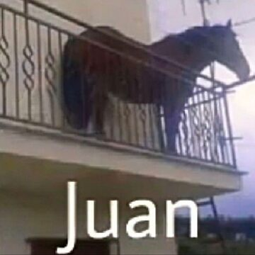
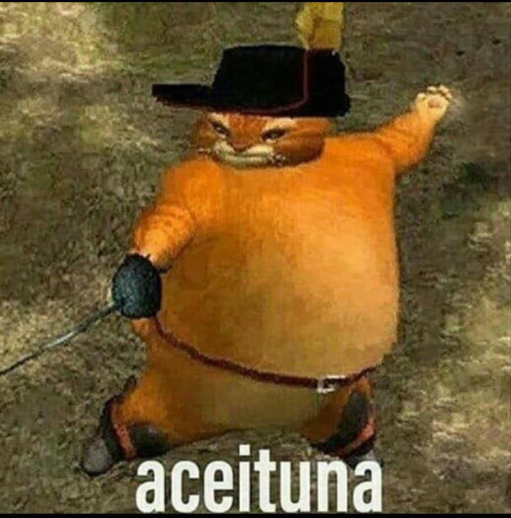
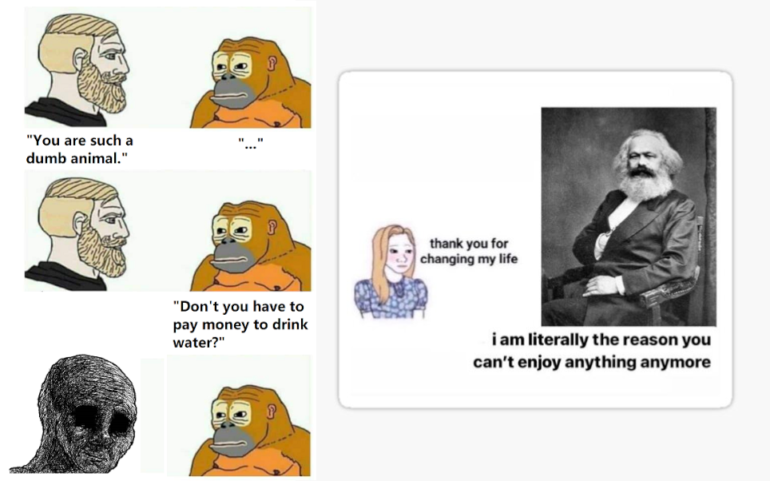
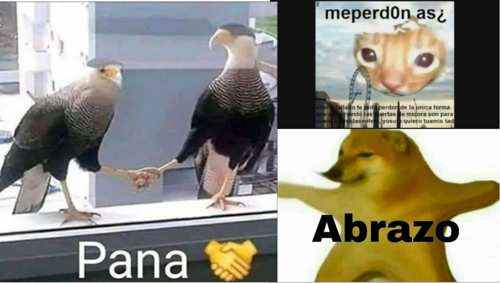
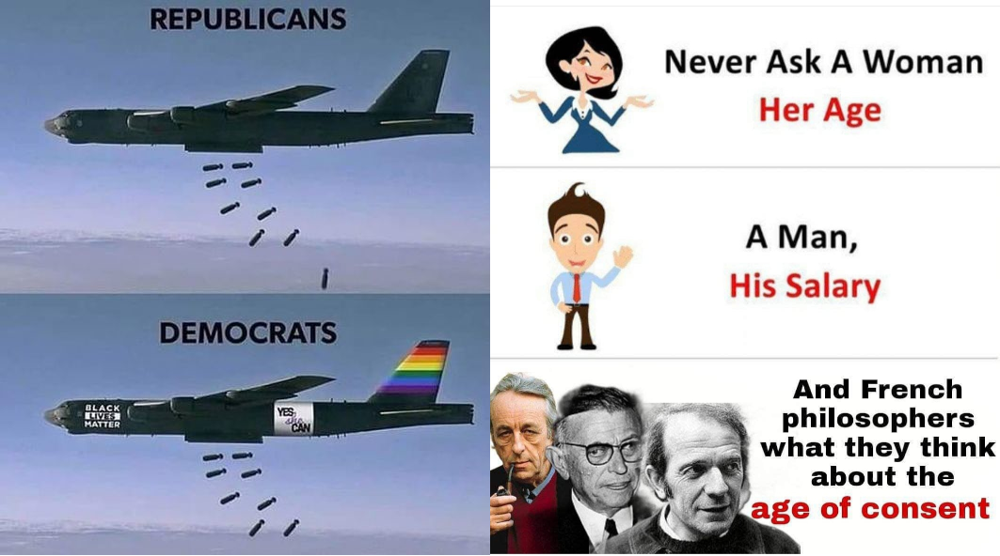

+++
title = "Filosofía de los memes"
date = 2023-01-30
draft = false

[taxonomies]
categories = ["philosophy"]
+++

# Disclaimer inicial

Este post no pretende hacer un estudio histórico o literario del género memístico. Su propósito principal es tratar el género desde un punto de vista puramente hermenéutico, desligando la obra de las posibles intencionalidades iniciales de su autor/a. 

Me gusta pensar en la categoría meme como una nueva forma literaria, en cierto modo rompedor con la literatura anterior en cuanto al uso de nuevos recursos como un simbolismo iconográfico muy marcado, pero que sigue teniendo cierta continuidad como las referencias al contexto presente o pasado o el uso de recursos literarios como la aliteración, la metáfora o la hipérbole.

Las subcategorías dentro del género son abrumadoramente amplias: desde las más "wholesome" (memes que fomentan los sentimientos afectivos hacia otras personas, animales u objetos), hasta los más "dank" (memes con referencias satíricas a comportamientos no considerados políticamente correctos), pasando por los memes "fast" (los creados temporalmente ad hoc, donde el contexto es muy importante). Cada subcategoría evoluciona a medida que se relaciona con su entorno, bebiendo de otras subcategorías y rechazando el material que no ha tenido una buena adaptación al público. Reflexionaremos más adelante sobre la relación con el público y el concepto de atre (leer el post de El arte y el atre). Otra de las subcategorías más importantes es la del "shitpost", carecterizada por una estética marcadamente antiestética, consiguiendo así una dialéctica en la imágen en confrontación directa con las técnicas ilustrativas hasta la fecha.

A continuación vemos algunos conceptos ejemplificados en memes concretos. 

---

# Algunas subcategorías

## Shitpost
No es el mero hecho de intentar advertir cualidades humanas en un animal por medio de la personificación, ni la misma atípica situación en escena del mismo. Lo que dota de forma (que no contenido) al shitpost es la relación de objetos que lo componen, sin ninguna importancia en los objetos. Cada objeto, cada elemento indivisible presente en la obra es de contenido nulo si no fuese por las relaciones que los atañen. Como he dicho anteriormente no es una relación intencionada por el autor, o, al menos, si lo es, importa bien poco. La importancia reside en las ideas que el espectador relacione (o no) al contemplar la obra, en las elucubraciones que uno hace al pensar como ha podido ser concebida, en el intento de desmistificar aquello que te es tan extraño y familiar al mismo tiempo.

El shitpost, por tanto, es una inversión de la lógica, y, como tal, toma forma en la conciencia del espectador. Como defiendo en otro post (El arte y el atre) no tiene sentido analizar el atre por sus características técnicas, ni por sus virtudes "objetivas", sino que depende de la lectura íntegra que haga la conciencia enajenada del espectador. Que el shitpost pueda o no triunfar como género (esto es, pueda ganar peso dentro del mercado del arte, que no el atre) es un hecho meramente independiente de que lo haga en mi conciencia.

## Pensamiento 
Soy de los que piensa que no existe ninguna idea que no pueda ser formulada desde la categoría humorística. Es por eso que hay memes que, a expensas de buscar la risa terminan por producir una reflexión estimulante. La subcategoría que más me gustaría destacar es la que hace una reflexión pesimista, aunque certera de la realidad, unas palabras que invitan al pensamiento más profundo de por qué la sociedad está en este estadio y como la alienación pervierte la conciencia. Un par de frases consiguen arrancar una furia que nace de las entrañas del espectador más sensibilizado, y provoca ríos de pensamiento que desembocan en un lago de cada vez más y más dudas sobre la teoría y la praxis. Tiempo de reflexionar si la historia siempre va hacia delante como siempre nos han contado.

Me resulta fascinante pensar también cómo esta categoría es capaz de deconstruirse, de dar la vuelta sobre sí misma, de reducirse tan inteligentemente sobre el concepto de la alienación. Haya o no calado el meme en nuestro constantemente bombardeado cerebro, el siguiente acto será el de hacer scroll para ver la siguiente pieza, un acto propio y natural de la reificación del ser que sufrimos. La magia, una vez más, de la contradicción en movimiento, de la dialéctica, aparece en los lugares más insospechados.

## Con propósito
Hasta ahora hemos hablado únicamente de la relación del espectador con el contenido, pero hemos supuesto que este espectador era único. Existen categorías como la de los memes con un propósito donde se involucran al menos dos personas en el proceso de espectación. Un agente es el que realiza la primera acción de enviar con un propósito la pieza, mientras que el otro la recibe. Observamos como se ve inalterada el atre que yace de la obra, pues tanto el primer agente como el segundo pueden interpretan el meme de acuerdo exclusivamente con sus propias ideas. Pese a que pueda parecer que el primer agente haga un intento de influenciar al segundo en la lectura, este dotaría en última instancia de un contexto único y personal a la pieza recibida.

En la primera imagen pueden advertirse elementos propios de la categoría shitpost, pero he decidido ejemplificarla en esta categoría, ya que me resulta un claro ejemplo de un meme con propósito. 

## Contextuales
Hay obras que refieren cierto conocimiento (y posicionamiento implícito) sobre una determinada coyuntura histórico-social, ya sea pasada, presente o futura. Esta es, quizá, la subcategoría más "targeted" en cuanto a un público determinado se refiere (con bastante solapamiento con la de pensamiento), generando aceptación o rechazo en función del espectador. Aunque en este caso hay una clara intención por parte del autor, considero más interesante analizarlo desde la óptica del atre. Desde la posición del espectador pueden suceder varios fenómenos, entre ellos destaco los siguientes:
- Cámara de eco: al estar sometido exclusivamente a obras de cierto sector de la subcategoría puede llevar a un reforzamiento "virtual" de las ideas reflejadas sin ninguna formación o racionalización o reflexión sobre los conceptos tras las ideas señaladas.
- Satirización de la antítesis: es posible que el público consuma un sector de la subcategoría que no se corresponde con sus ideas, ya sea de forma directa o a través de un metameme que pretende precisamente riduculizar el meme original.
- Motivación formativa: la obra sirve como motivación para el estudio del contexto histórico-social de la misma. 

No obstante, no es necesario la existencia de esa polarización en el público de la obra, pudiendo esta reflejar hechos históricos más o menos documentados y aceptados por amplia parte de la población, pese a que ese hecho en particular pueda favorecer o enarbolar alguna ideología particular.

---

# Conclusión 
Es curioso observar como cambia la concepción de determinados géneros literarios generacionalmente. Cómo, por ejemplo, el cómic marcó a toda una generación, al igual que lo hace ahora el meme. No pretendo hacer una defensa empedernida del género, al contrario, pues rompería todos los ideales y fundamentos del concepto de atre, desde el cual disfruto tanto analizando cada obra.

Queda por ver qué senda seguirá este género en el futuro, o más bien qué sendas, pues cada subcategoría marca su propio paso y se distingue bien del resto por medio de ese público, previsiblemente aún mediado por el mercado.

Termino dejando, por completitud, un compendio de memes <a href="https://tinyurl.com/completememecollection"> aquí</a>.
