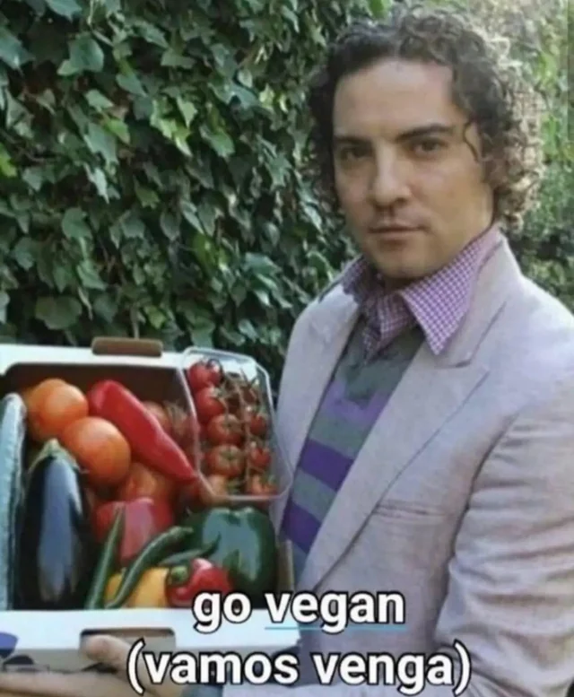

+++
title = "Go vegan (vamos, venga)"
date = 2026-08-31
draft = false

[taxonomies]
categories = ["philosophy", "food"]
+++

Today I turn 24. Marked days on the calendar like this one always make a person reflect on how they want to live their life, what they want to share with others, and how they want to shape their relationship with everything around them.

I write this post out of fury, impotence, and sadness, but also out of optimism and well-being. Today, as well, I celebrate one year in Germany and one year of being fully vegan, a step I had always wanted to take throughout my six years of vegetarianism, but wasn't (let's face it) brave enough to make. During that period, I had a frustrating relationship with food. On the one hand, I felt bad for not fully contributing to animal welfare while still consuming dairy products and eggs. On the other hand, this shaped some interactions with friends and family, creating awkward situations. I'll give an example in the next paragraph.

Let's say you are having dinner with a group of friends. You're eating a salad and they are eating a steak or burger. You are all fully aware of the situation, and they are too. Inevitably, at some point, they will look at their piece of animal carcass and then look at you. Sometimes they will try to make a comment, either in a funny tone or as half an apology; other times they will just stare at you with a sorry face. I have always had a lot of trouble handling this situation. My social awkwardness peaked in these moments: I couldn't really find the words or the appropriate way to express myself. I guess you have three options:
- Play safe. Just smile and let it go. This is the stoic approach.
- Explain to them that it is okay, just a matter of choices. I make my own choices to feel good with myself, and you do the same with yours; then everybody wins. This is the consensus approach.
- Carefully explain to them that there is no reason to eat a FUCKING DEAD ANIMAL BODY ON THEIR PLATES. I call this the radical approach.

When I don't know the people or I am just too lazy, I used to choose the first. With people I know, I used the second. I never chose the third. Partly because I was aware I wasn't doing everything in my power, and partly because I was scared. Scared of building my personality around this, of monopolizing the conversation every single time, and of not being interesting or engaging enough.

I now realize that I was hiding part of my personality in Spain just because I was scared of these things. I used to have only one vegetarian friend and one vegan friend. Since I moved here, the norm is the opposite. I have a vegan roommate and lots of vegan and vegetarian friends. Every time we hang out, we go to a vegan or vegetarian place; it is not even a question that needs to be addressed, it is just the norm.

# How do I address the topic?
As mentioned, I mainly used to take the consensus approach. Those days are over, though, in favor of the radical one.

The word "radical" is always very loaded. It is often presented in the news as something "extreme" and negative in most cases. But far from that, the dictionary describes it as "believing or expressing the belief that there should be great or extreme social or political change". That's all. I want social change. I want people to halt the consumption of dead animals. I want to stop the suffering. There is absolutely no need nowadays to eat meat. You can get all the nutrients you need with a vegan diet. It is cheaper and better for your body. There is no doubt about this (more in the next sections).

So, from now on, whenever I have to choose an approach, I will go with the radical one. I have the arguments, I have the belief, and I have the ethics. I don't care about anything else.

# Vegan diet is better, cheaper, and actually easy to follow
I am not even gonna cite an article. If you got to this point, I am sure you have enough interest and intelligence to find references for yourself. People usually oppose following a vegan diet because:
- **They think it's more expensive**. This is absolutely false. Legumes and beans, for instance, make up a large part of the protein intake of a healthy vegan diet, and they are way cheaper than meat. Sure, I can buy the argument that vegan substitutes like "fake meat" could be more expensive than the thing they are trying to substitute, or that a vegan restaurant could be more overpriced than a regular one (this is not always the case, though). But if we just compare a healthy homemade vegan diet with an omnivore one, the vegan one is cheaper by far.
- **They think it's worse**. This is, again, false. I will discuss this in detail in another section, but as long as you follow some easy and straightforward rules and supplement correctly, you will have all the nutrients you need. More on this in the protein section.
- **They think it's difficult**. I claim that having a healthy plant-based diet takes exactly the same effort as a regular one.

# The elephant in the room: protein
I will give you three facts:
- The ratio of vegan people in the world is ~1%
- The ratio of vegan high-performance athletes is ~1%
- The ratio of vegan marathon runners is ~10%
Next time you go to the gym and have to deal with the Dorito-looking gymbro who always tells you a plant-based diet is bullshit, you can just show him the facts (and tell him "fuck you" on my behalf).

Jokes aside, protein intake in a plant-based diet is slightly more challenging than in a regular diet, but it is actually pretty easy if you know the basics. Legumes, grains, beans, soy in all its forms, pasta, etc. All of them contain enough protein for you. The catch? It is normally incomplete, unlike meat (with some exceptions). In order to meet your protein needs, you must combine them wisely. Luckily, this takes only a few minutes of research. If you're curious like me, you will end up learning about the nine essential amino acids along the way (which I find pretty cool!), but otherwise you can just rely on vegan recipes, which are usually designed to balance them so that you don't need to worry.

That was about quantity, but when it comes to quality, plant-based protein offers us a lot of advantages. First, I would like you to ask yourself how much fiber and how many antioxidants you are getting. On a vegan diet, protein sources like lentils, whole grains, and beans are not only protein sources, but also provide an essential component of gut health: fiber. While eating meat gives you a higher protein-to-weight ratio and nothing else, eating these plant-based alternatives also gives you other healthy nutrients.

# Supplementation is actually easy and safe
I won't really go into specific details. Unfortunately, there are some essential components that a vegan diet cannot reliably offer us. However, B12 is the only one that is absolutely non-negotiable. You might also be low in Omega-3, vitamin D3 (in case you live in a region with little sunlight), and iron. You can technically get these from a plant-based diet, but keeping track of them might be challenging. For instance, I supplement with:
- An effervescent tablet of B12 + D3
- An effervescent multivitamin tablet
- I will probably include Omega-3 soon as well
I keep track of my health by getting blood tests every six months, and it usually goes pretty well.

Well, for those who say "but supplementation is not natural," fuck you all. Half of the products you probably consume are not "natural" either, and you're reading this on a fucking screen; blue light is anything but natural. The amazing thing about technology is that it gives us the possibility of doing such things for better, more sustainable health.

A big disclaimer here (which I think I found the most annoying) is related with the dosis. Due to low absortion of B12 vitamin on plant-based diets, it is very important to know excatcly how much you should take. As mentioned, blood analysis, altough not bein the ultimate source of true, help a lot to check that everything is going how it should be. Protein works like this as well: your absorption rate will be slightly smaller, and also you would have to take into account how much sport you do to target the intake.

# Disclaimer and final thoughts
As I mentioned in the introduction, I wrote this post to finally switch from the consensus approach to a more radical approach with my friends, acquaintances, and family. I am not an expert in the field, of course, and I know very little, but I like the learning process. I also believe that this is not the most important problem we have to solve, but the good thing is that it is a completely parallel issue.

I guess I have always been pissed off at passive people who are, in general, capable of acknowledging a problem but are not willing to do shit about it. Conservatism is what kills ideas, in my opinion. So, please, don't let them just lie in the world of ideas.

Of course, if you followed the whole text until here, that probably means I sparked some interest in the topic. I purposefully don't include any references in this article because I would like you to explore on your own afterwards, without being biased by a random guy on the internet like me. Find its positive aspects, its negatives, the ways to implement it, and whatever suits you best.

I want to conclude with a personal experience. Switching to a plant-based diet can be, apart from all the aforementioned things, a spiritual experience. Stopping after every meal and thinking that you are not contributing to this horrible industry is something you can definitely enjoy. This feeling is one of the most beautiful ones that I have ever experienced.
